<div align="center">


# CarpetChanger

**Ten varias versiones de un juego (o de cualquier programa) y cambia cuál usa con un clic.**


[](https://github.com/MacWilliXD/CarpetChanger/releases/latest)

### [⬇️ Descargar CarpetChanger.exe](https://github.com/MacWilliXD/CarpetChanger/releases/latest/download/CarpetChanger.exe)

<sub>Portable · Windows 10/11 · un solo archivo que ya lo incluye todo: no hay que instalar Python ni nada más</sub>

<br><br>

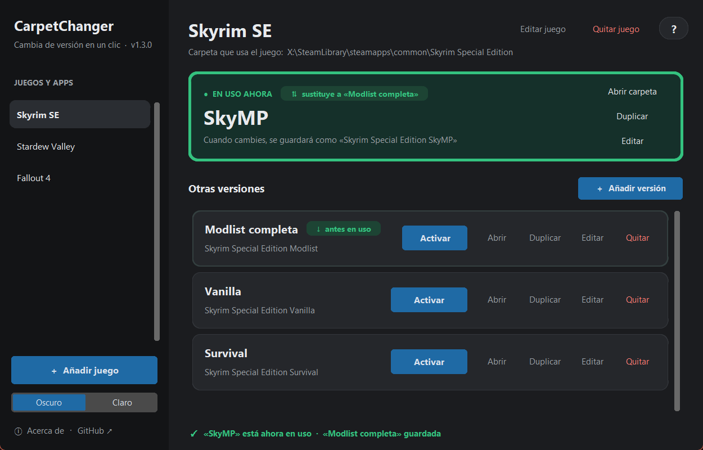

</div>

---

## ¿Para qué sirve?

Muchos juegos solo leen **una carpeta con un nombre fijo**. Skyrim, por ejemplo, siempre arranca desde
`steamapps\common\Skyrim Special Edition`. Si quieres tener varias instalaciones distintas (una con tu
lista de mods, otra limpia, otra para multijugador…), lo normal es ir renombrando carpetas a mano.

CarpetChanger hace ese cambio de nombre por ti, de forma segura:

- La versión **en uso** ocupa el nombre que espera el juego.
- Las demás esperan al lado, cada una con su propio nombre.
- Al activar otra, la actual vuelve a su nombre y la elegida pasa a ocupar el nombre del juego.

```text
Antes                                         Después de activar «SkyMP»
──────────────────────────────────────        ──────────────────────────────────────
Skyrim Special Edition          ← en uso      Skyrim Special Edition Modlist
Skyrim Special Edition Vanilla                Skyrim Special Edition Vanilla
Skyrim Special Edition SkyMP                  Skyrim Special Edition          ← en uso
Skyrim Special Edition Survival               Skyrim Special Edition Survival
```

<div align="center">
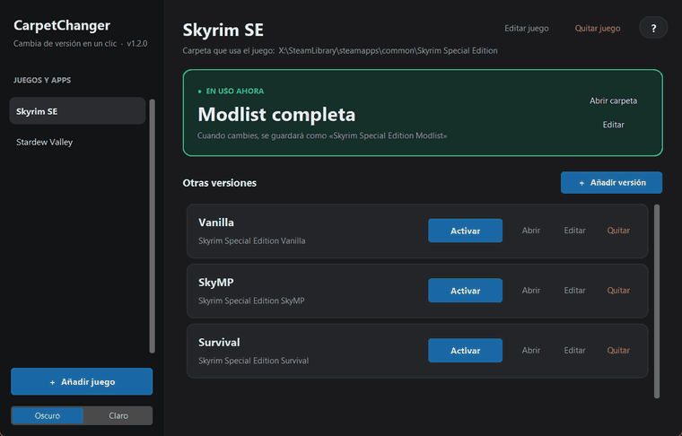
<br><sub>Al pulsar <b>Activar</b>, la versión elegida sube a «en uso» y la anterior baja a la lista.</sub>
</div>

> [!NOTE]
> Cambiar de versión solo **renombra** carpetas: nunca copia, mueve ni borra nada. Por eso es instantáneo,
> aunque la carpeta pese decenas de GB. Lo único que copia es **Duplicar**, y nunca toca la original.

## Características

| | |
|---|---|
| **Varios juegos y apps** | Cada uno en su propia entrada de la barra lateral; añade todos los que quieras. |
| **Un clic** | Botón **Activar** en cada versión (o doble clic sobre ella). |
| **Se ve qué cambió** | Las tarjetas se intercambian con una animación, y la nueva y la anterior quedan señaladas unos segundos. |
| **Duplicar** | Copia cualquier versión con otro nombre (p. ej. para probar mods sin tocar la original), con barra de progreso, comprobación de espacio y cancelación sin restos. |
| **Detección automática** | Al añadir un juego encuentra solas las carpetas de al lado que empiezan por el mismo nombre. |
| **Lee el disco** | El estado se calcula a partir de las carpetas reales; si renombras algo a mano, la app lo detecta. |
| **Seguro** | Si el segundo renombrado falla, deshace el primero; si una copia falla o se cancela, se borra. Nunca queda nada a medias. |
| **Desbloqueo inteligente** | Si una carpeta está en uso, averigua qué programa la tiene abierta y lo resuelve o te dice cuál cerrar. |
| **Portable** | Un único `.exe`, sin instalación. La configuración se guarda a su lado. |
| **Ayuda integrada** | Botón **?** (o F1) con una guía completa, y tooltips en cada botón y nombre. |
| **Tema claro y oscuro** | Se recuerda entre sesiones. |

## Capturas

<table>
  <tr>
    <td width="50%">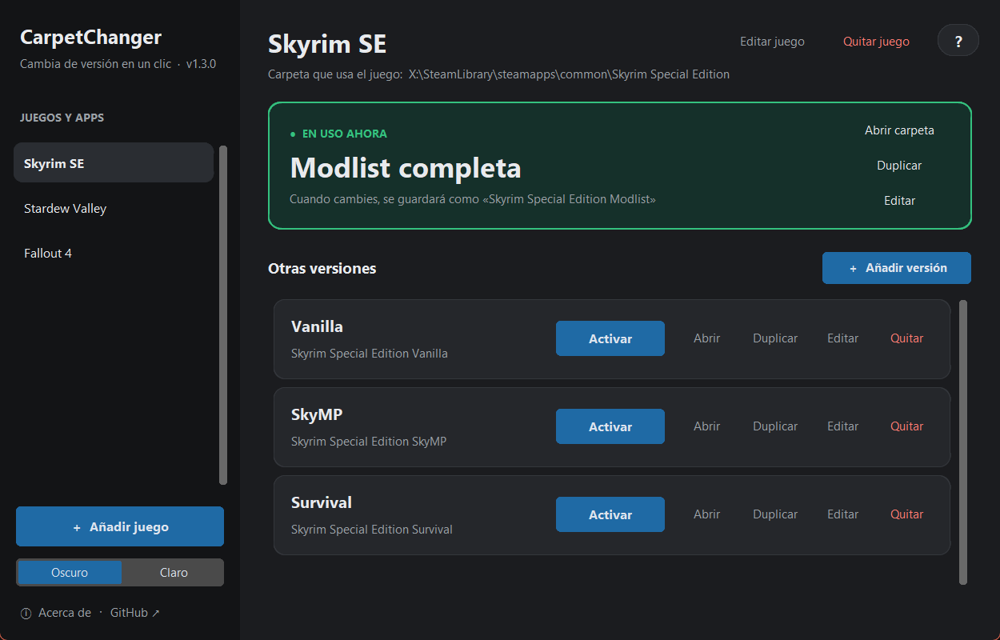</td>
    <td width="50%">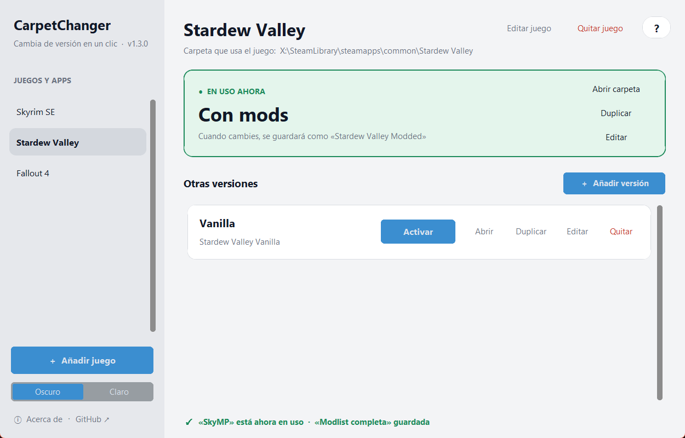</td>
  </tr>
  <tr>
    <td align="center"><sub>Tema oscuro: la versión en uso arriba y las demás debajo, cada una con su botón <b>Activar</b>.</sub></td>
    <td align="center"><sub>Tema claro, con otro juego.</sub></td>
  </tr>
  <tr>
    <td width="50%">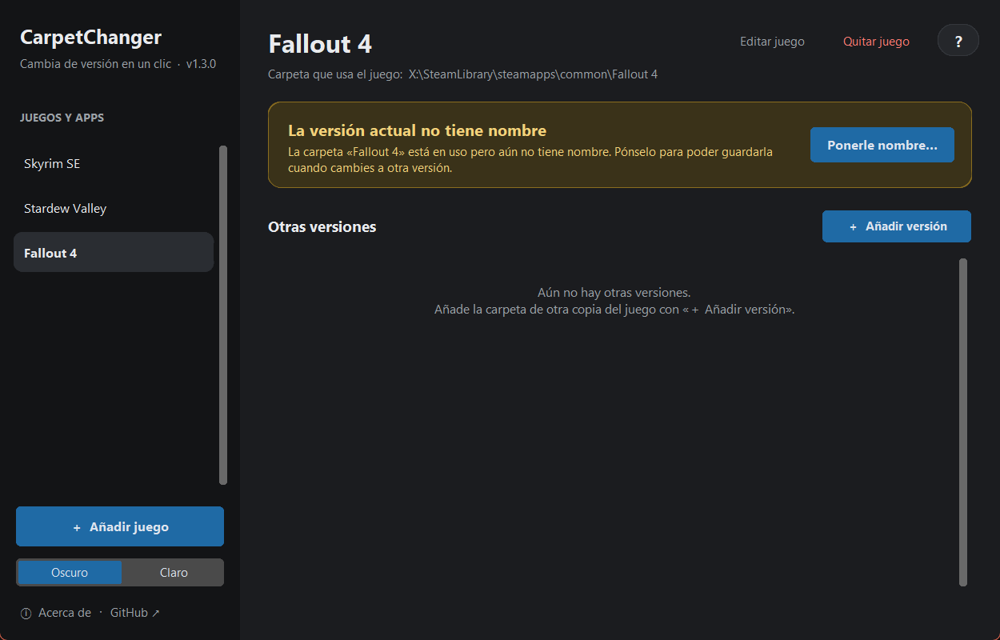</td>
    <td width="50%">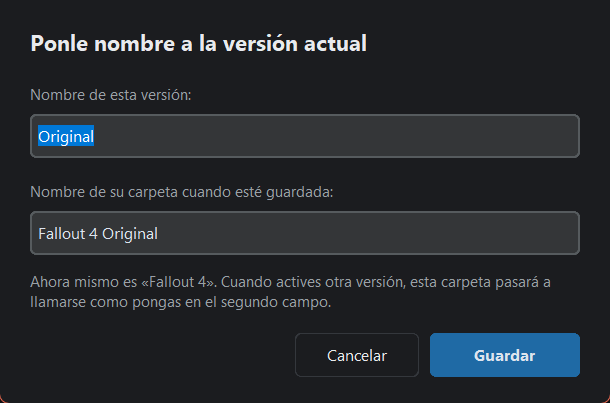</td>
  </tr>
  <tr>
    <td align="center"><sub>Si la carpeta en uso aún no tiene nombre, la app te avisa…</sub></td>
    <td align="center"><sub>…y te pide uno para poder guardarla al cambiar.</sub></td>
  </tr>
  <tr>
    <td width="50%">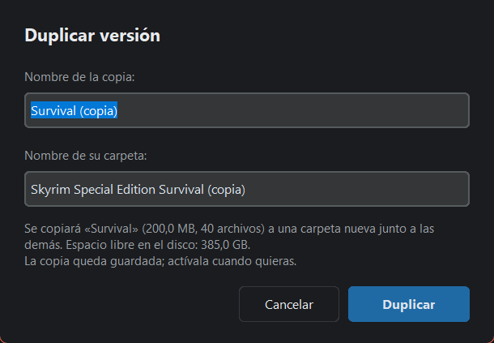</td>
    <td width="50%">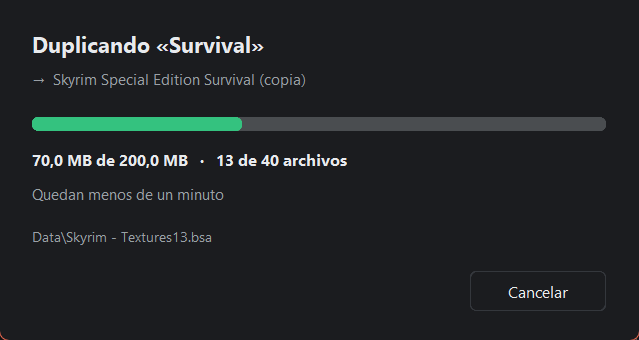</td>
  </tr>
  <tr>
    <td align="center"><sub><b>Duplicar</b>: elige el nombre de la copia; la app comprueba antes que haya espacio…</sub></td>
    <td align="center"><sub>…y muestra el progreso. Si cancelas, no queda nada a medias.</sub></td>
  </tr>
</table>

## Descarga e instalación

No hace falta instalar nada.

1. **[Descarga `CarpetChanger.exe`](https://github.com/MacWilliXD/CarpetChanger/releases/latest/download/CarpetChanger.exe)**
   (siempre la última versión). Las anteriores están en [Releases](https://github.com/MacWilliXD/CarpetChanger/releases).
2. Ponlo en cualquier carpeta (escritorio, una carpeta de herramientas, un USB…).
3. Ábrelo con doble clic. **No hace falta ejecutarlo como administrador.**

> [!TIP]
> No lo pongas *dentro* de la carpeta de un juego que vayas a gestionar: esa carpeta se renombra y la app
> estaría dentro de ella.

### «Windows protegió su PC»

La primera vez, Windows SmartScreen puede mostrar este aviso. No significa que se haya encontrado nada
malo: avisa de cualquier ejecutable nuevo que todavía no tiene "reputación" y no está firmado con un
certificado comercial. Para abrirlo:

1. Pulsa **Más información**.
2. Pulsa **Ejecutar de todas formas**.

Solo hace falta la primera vez. Si prefieres comprobarlo antes:

- **Es de este repositorio:** cada `.exe` lo compila automáticamente
  [GitHub Actions](https://github.com/MacWilliXD/CarpetChanger/actions) a partir del código publicado, y
  la Release incluye su huella SHA-256. Compruébala con `Get-FileHash .\CarpetChanger.exe` en PowerShell.
- **Pásalo por [VirusTotal](https://www.virustotal.com/)**, o ejecuta directamente `carpetchanger.pyw`
  con Python (ver [Compilar desde el código](#compilar-desde-el-código)).

Para reducir los falsos positivos, el `.exe` se compila sin compresión UPX, con metadatos de versión
completos y con un bootloader de PyInstaller compilado desde el código fuente, en vez del precompilado
genérico que suelen marcar los antivirus.

## Cómo se usa

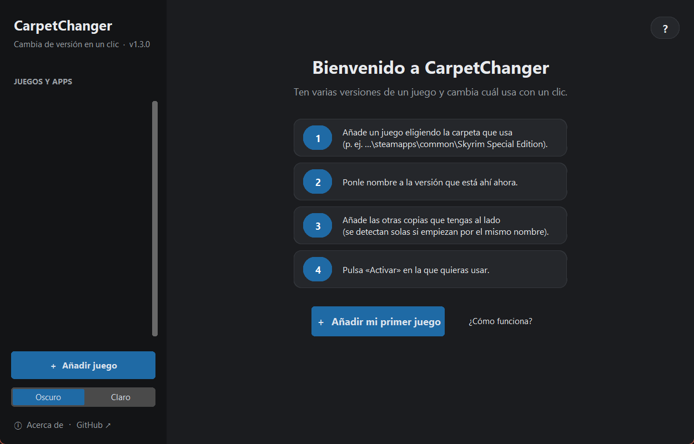

1. **Añade un juego.** Pulsa **＋ Añadir juego** y elige la carpeta que usa el juego, la que tiene el
   nombre original (p. ej. `…\steamapps\common\Skyrim Special Edition`).
2. **Acepta las versiones detectadas.** Si junto a ella hay carpetas como `Skyrim Special Edition Vanilla`,
   la app te propone añadirlas. Toma como nombre lo que va después del nombre original (`Vanilla`).
3. **Ponle nombre a la versión actual.** La carpeta en uso todavía no tiene un nombre "de guardado"; la app
   te lo pide (por defecto, `Original`) para saber cómo llamarla cuando actives otra.
4. **Pulsa Activar** en la versión que quieras usar. Listo: abre el juego normalmente.

> [!TIP]
> ¿Dudas? Pulsa el botón **?** de arriba a la derecha (o **F1**) para abrir la guía, o deja el ratón quieto
> sobre cualquier botón o nombre para ver qué hace.

<div align="center">
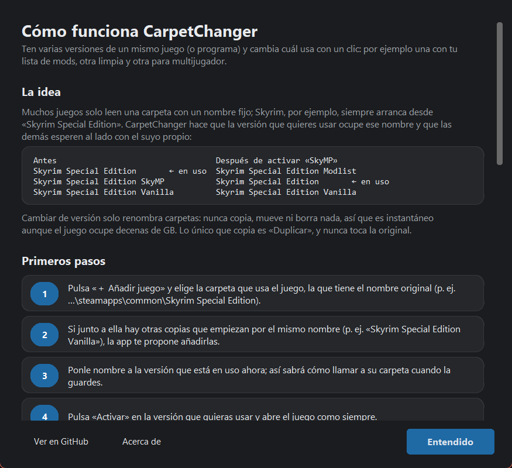
</div>

Más cosas que puedes hacer:

- **＋ Añadir versión**: añade otra carpeta que esté junto a la del juego.
- **Editar**: cambia el nombre que ves o el nombre de su carpeta (si está guardada, también se renombra en el disco).
- **Abrir**: abre la carpeta en el Explorador.
- **Duplicar**: hace una copia completa de esa versión con otro nombre, junto a las demás. Antes comprueba
  que haya espacio libre, muestra el progreso y el tiempo restante, y si cancelas (o algo falla) borra lo
  copiado. La copia queda guardada; actívala cuando quieras. Si duplicas la versión en uso, cierra antes el juego.
- **Quitar**: la saca de la lista. **No borra la carpeta.**
- **Editar juego / Quitar juego**: lo mismo para el juego entero. Tampoco toca el disco.

> [!IMPORTANT]
> Todas las versiones de un juego tienen que estar **en la misma carpeta** que la versión en uso (por
> ejemplo, todas dentro de `steamapps\common`). Así el cambio es un renombrado instantáneo y no una copia.

## Si dice que la carpeta está en uso

Windows no deja renombrar una carpeta mientras algún programa tiene algo abierto dentro de ella. Antes de
cada cambio, CarpetChanger hace lo siguiente:

1. **Cierra las ventanas del Explorador** que estén mostrando esas carpetas (solo esas).
2. **Suelta lo que el Explorador deja abierto** aunque no haya ninguna ventana. Es habitual: a veces
   `explorer.exe` se queda vigilando subcarpetas como `Data`.
3. Si aun así falla, **busca qué programa la está usando** y:
   - si es el Explorador, te ofrece reiniciarlo y reintentar;
   - si es otro programa, te dice cuál cerrar;
   - si no lo encuentra (por ejemplo, porque está abierto como administrador), te abre el **Monitor de
     recursos** con la ruta ya copiada para que la busques.

Los culpables habituales son el propio juego, Steam u otros launchers, los gestores de mods (Mod Organizer 2,
Vortex), los editores (Creation Kit, xEdit, VS Code) y las consolas abiertas dentro de la carpeta.

## Compilar desde el código

Requisitos: Windows y **Python 3.10 o superior**.

```powershell
git clone https://github.com/MacWilliXD/CarpetChanger.git
cd CarpetChanger
pip install -r requirements.txt

# Ejecutar sin compilar
python carpetchanger.pyw

# Generar el .exe portable en dist\CarpetChanger.exe
python build.py
```

`build.py` vuelve a dibujar el icono (`assets/icon.ico`) y empaqueta todo con PyInstaller en un único
ejecutable, con los metadatos de versión incluidos.

### Publicar una versión nueva

1. Sube `__version__` en `carpetchanger.pyw` (p. ej. `1.0.1`) y haz commit.
2. Crea y sube la etiqueta correspondiente:

   ```powershell
   git tag v1.0.1
   git push origin main v1.0.1
   ```

GitHub Actions compila el `.exe` en una máquina Windows limpia, lo pone a prueba y publica la Release con
el ejecutable y su SHA-256. El enlace de descarga del README apunta siempre a la última versión.

### Autodiagnóstico

El `.exe` incluye una prueba que se puede lanzar en cualquier PC:

```powershell
.\CarpetChanger.exe --selftest informe.txt
```

En una carpeta temporal (sin tocar nada tuyo) intercambia carpetas de prueba, comprueba la detección de
bloqueos y abre la interfaz. Deja el resultado en `informe.txt` y termina con código 0 si todo va bien.
GitHub Actions la ejecuta sin Python en el sistema antes de publicar cada versión, para garantizar que el
`.exe` lleva dentro todo lo que necesita.

## Configuración

Se guarda en `carpetchanger.json`, junto al `.exe`. Si en esa carpeta no se puede escribir, se guarda en
`%APPDATA%\CarpetChanger`. Es un JSON legible:

```json
{
  "theme": "dark",
  "games": [
    {
      "name": "Skyrim SE",
      "base": "C:\\Program Files (x86)\\Steam\\steamapps\\common",
      "active_name": "Skyrim Special Edition",
      "variants": [
        { "name": "Original", "folder": "Skyrim Special Edition Original" },
        { "name": "SkyMP",    "folder": "Skyrim Special Edition skymp" }
      ],
      "active": "Original"
    }
  ]
}
```

- `base`: carpeta que contiene todas las versiones.
- `active_name`: nombre que espera el juego.
- `folder`: cómo se llama cada versión cuando **no** está en uso.

No hace falta guardar cuál está activa para que funcione: la app lo deduce cada vez a partir del disco (la
activa es la única cuya carpeta "de guardado" no existe).

## Estructura del proyecto

```text
CarpetChanger/
├── carpetchanger.pyw    # La aplicación (lógica + interfaz con CustomTkinter)
├── build.py             # Genera el icono y compila el .exe con PyInstaller
├── requirements.txt
├── assets/
│   └── icon.ico
├── docs/img/            # Capturas para este README
└── .github/workflows/
    └── release.yml      # Compila el .exe y publica la Release al subir una etiqueta v*
```

## Preguntas frecuentes

**¿Funciona con juegos que no son de Steam o con programas que no son juegos?**
Sí. Sirve para cualquier carpeta que un programa espere encontrar con un nombre fijo.

**¿Puede romper mi instalación?**
Cambiar de versión solo renombra carpetas, y si algo falla a mitad del cambio, lo deshace. Duplicar nunca
modifica la original. Si quitas un juego o una versión de la lista, las carpetas se quedan tal cual en el disco.

**¿Cuánto ocupa duplicar?**
Lo mismo que la versión original: es una copia completa. La app te dice el tamaño y el espacio libre antes
de empezar, y no te deja continuar si no cabe.

**¿Qué pasa con las actualizaciones de Steam?**
Steam actualiza la carpeta que lleva el nombre del juego, es decir, la versión **en uso**. Si quieres
evitar que toque una versión concreta, actívala solo cuando la vayas a usar.

**Mi antivirus avisa del `.exe`.**
A veces pasa con los ejecutables generados con PyInstaller, aunque se han tomado medidas para evitarlo
(ver [«Windows protegió su PC»](#windows-protegió-su-pc)). Si te ocurre, puedes
[enviarlo a Microsoft como falso positivo](https://www.microsoft.com/wdsi/filesubmission), añadir una
excepción o ejecutar directamente `carpetchanger.pyw` con Python.

## Créditos

<table>
  <tr>
    <td>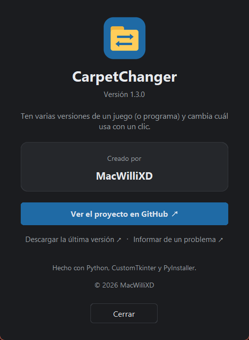</td>
    <td>

Creado por **[MacWilliXD](https://github.com/MacWilliXD)**.

Hecho con [Python](https://www.python.org/), [CustomTkinter](https://github.com/TomSchimansky/CustomTkinter)
y [PyInstaller](https://pyinstaller.org/).

Dentro de la app, **ⓘ Acerca de** (abajo a la izquierda) muestra los créditos, la versión y enlaces a este
repositorio, a la última versión y a la página para
[informar de un problema](https://github.com/MacWilliXD/CarpetChanger/issues).

  </td>
  </tr>
</table>
